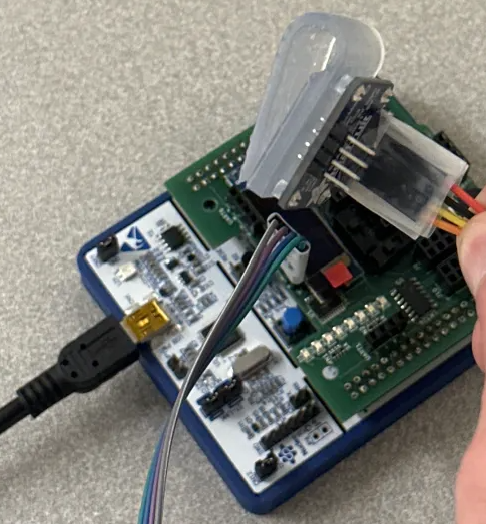
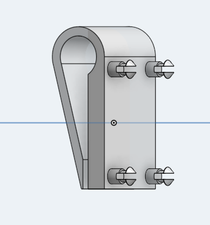
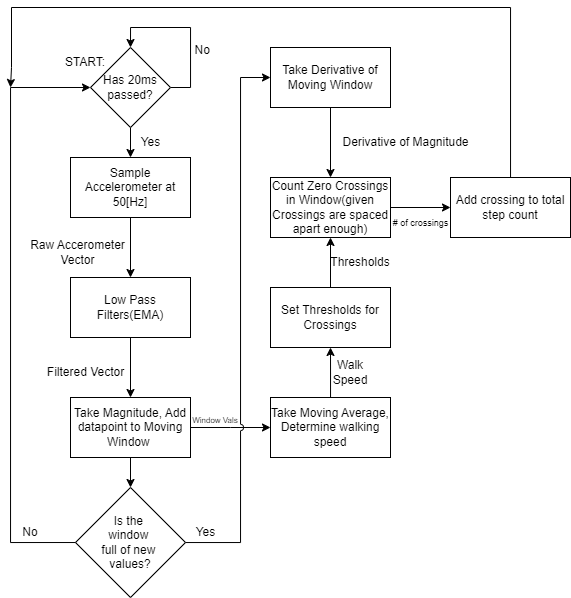

# Pedometer System
A step counter. Utilizes a moving window to zero crossings for the derivative of the magnitude of a filtered acceleration vector sampled from an IMU. 
## Required Parts:
- STM32F411RE MCU with UCSC Daughter Board
- BNO055 Adafruit IMU
- 4 male-to-male pin connectors

## Relevant Files
- Common: Libraries
- Images: Pictures of pedometer, relevent flowcharts etc
- MechanicalFiles: STL files for IMU holder
- Pedometer: Files made in the process of developing the pedometer. Testcode.c has the main loop. 
- SavedData: Data taken and Matlab code for analysis 

## Installation:
1. Print out IMU Clip with Increased Lock Pin Diameter (Optional).
2. Connect the power, ground, SCL, and SDA lines from the I2C pins on the Daughter Board to the BNO055 IMU.
3. Program MCU.

## How to Use:
1. Clip Pedometer securely to either hip.
2. Power up the MCU or program it if necessary.
3. Start Walking.
4. Observe the step count displayed on the OLED screen.

## Setup

## Holder

## Flowchart

